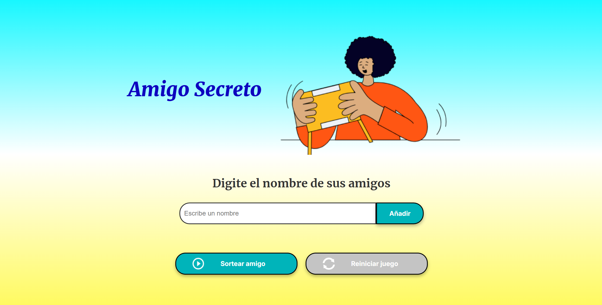
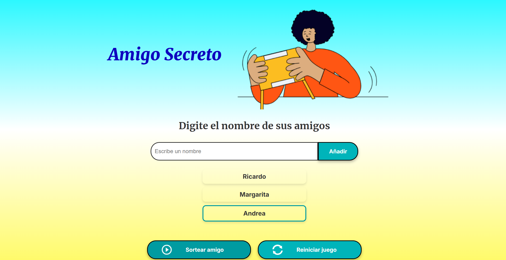
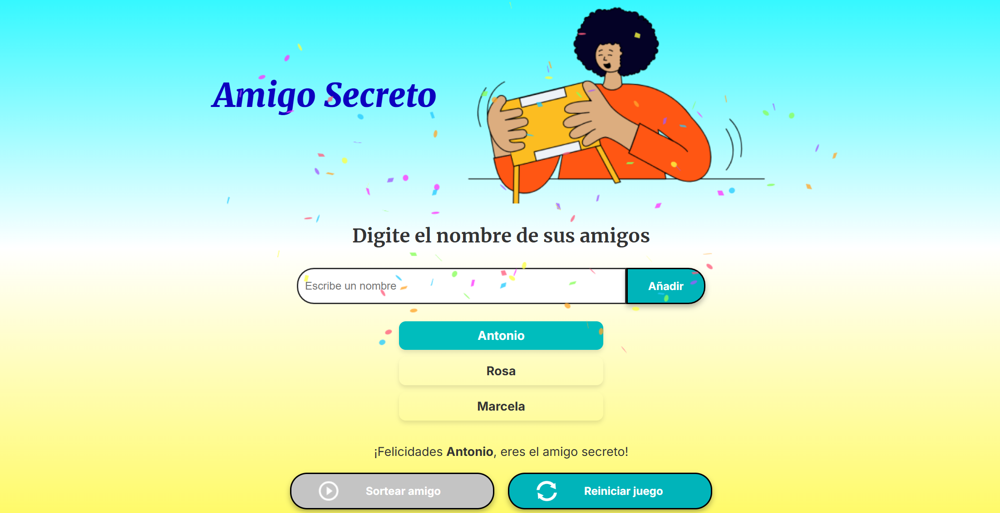
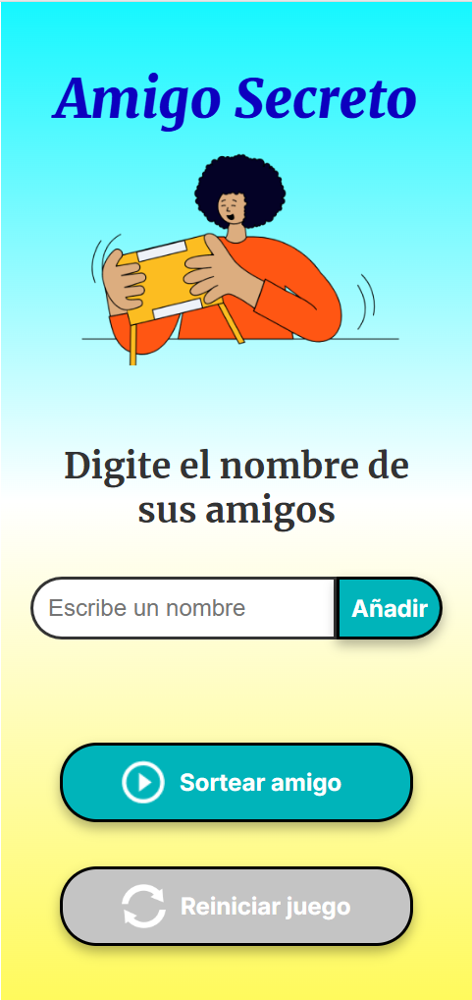
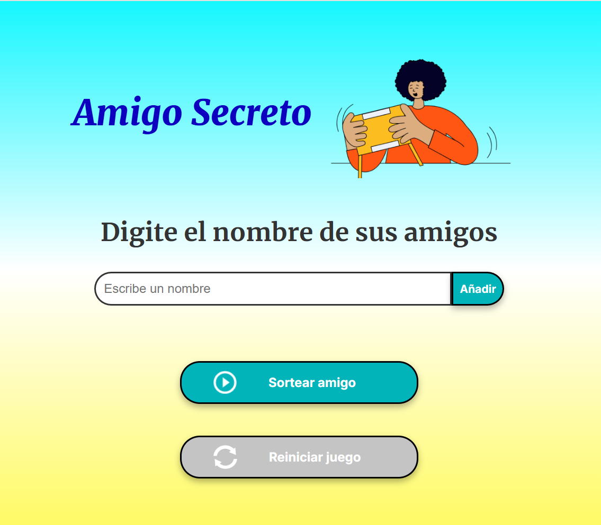
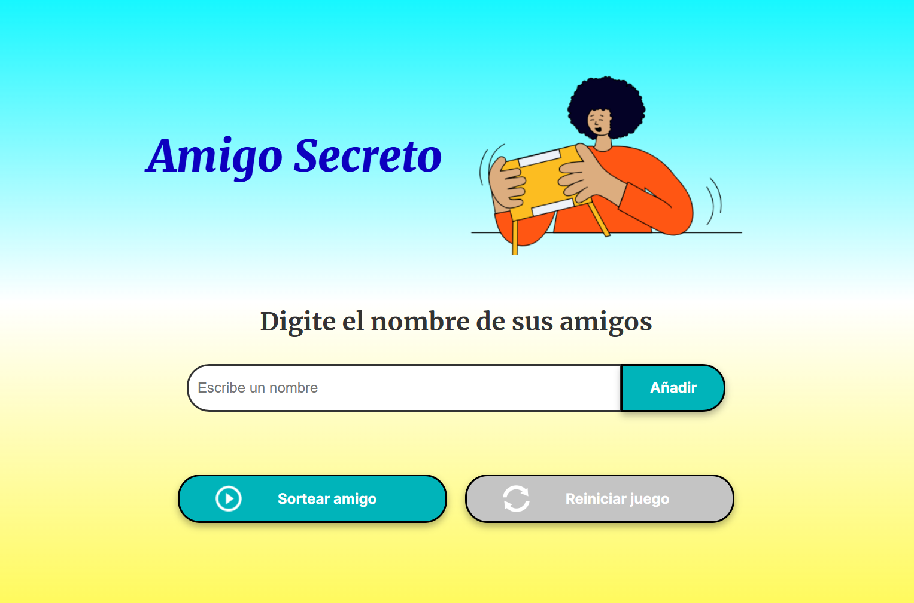

# 🎁 Amigo Secreto

## 📌 Descripción

"Amigo Secreto" es una aplicación web que permite a los usuarios ingresar nombres de amigos y realizar un sorteo para asignar de manera aleatoria un "amigo secreto". 
La base del proyecto contiene los archivos HTML y CSS, ya que el propósito de este desafío es poner en práctica los conceptos adquiridos sobre lógica de programación con Javascript.

## 🎯 Funcionalidades

- ✍️ **Agregar nombres**: Los usuarios escribirán el nombre de un amigo en un campo de texto y lo agregarán a una lista visible al hacer clic en "Añadir".
- ⚠️ **Validar entrada**: Si el campo de texto está vacío, el programa mostrará una alerta pidiendo un nombre válido.
- 📜 **Visualizar la lista**: Los nombres ingresados aparecerán en una lista debajo del campo de entrada.
- 🎲 **Sorteo aleatorio**: Al hacer clic en el botón "Sortear Amigo", se seleccionará aleatoriamente un nombre de la lista y se mostrará en la página.
- 🚫 **Evitar nombres repetidos, caracteres especiales y números**.
- 🎉 **Sorteo animado con resaltado de nombres**.
- 🔔 **Notificaciones interactivas con SweetAlert**.
- 🎊 **Efecto de confeti al seleccionar el amigo secreto**.
- 🔄 **Posibilidad de reiniciar el juego**.

## 🛠 Tecnologías Utilizadas

- 🏗 **HTML5**: Estructura del proyecto.
- 🎨 **CSS**: Estilos personalizados y diseño responsivo.
- ⚙️ **JavaScript**: Lógica para agregar nombres, sorteo y validaciones.
- 🚀 **SweetAlert2**: Para alertas interactivas personalizadas.
- 🎇 **Canvas Confetti**: Para animación de celebración.
- 🔤 **Google Fonts**: Tipografías personalizadas.

## 🖼 Capturas de Pantalla

### 📂 Pantalla de Inicio del Proyecto Base
Esta captura muestra la pantalla inicial del proyecto base antes de modificar el diseño y agregar funcionalidad.


### 🏠 Pantalla de Inicio
Esta es la pantalla principal de la aplicación, donde los usuarios pueden ingresar los nombres de los participantes.


### 🔄 Sorteo en Proceso
Al presionar el botón "Sortear Amigo", la aplicación inicia el sorteo mostrando una animación resaltando nombres de la lista antes de seleccionar el amigo secreto.


### 🎉 Resultado Final
Después del sorteo, se muestra el nombre del amigo secreto con una animación de confeti para celebrar el resultado.


### 📱 Diseño Responsivo
La aplicación se adapta automáticamente a diferentes tamaños de pantalla para garantizar una experiencia óptima en dispositivos móviles, tabletas y computadoras.




## 📁 Estructura del Proyecto
```
Amigo-Secreto/
│── 📂 assets/           # Imágenes y íconos
│── 🎨 style/            # Archivos CSS
│── 📄 index.html        # Archivo principal
│── ⚙️ app.js            # Lógica del juego
│── 📖 README.md         # Documentación del proyecto
```

## 📥 Instalación y Uso

1. 📂 Clona este repositorio en tu máquina local:
   ```sh
   git clone https://github.com/Clariveljn/challenge-amigo-secreto.git
   ```
2. 🌐 Abre el archivo `index.html` en tu navegador.
3. ✍️ Ingresa los nombres de los participantes.
4. 🎲 Presiona "Sortear amigo" para realizar el sorteo.
5. 🔄 Reinicia el juego cuando desees empezar de nuevo.

## 👤 Autor
Desarrollado por **Clarivel Jeldres**.


